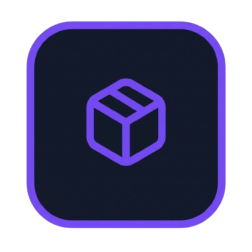

<div align="center">



# FvC Launcher

**A modern, fast and open-source Minecraft launcher.**
Isolated profiles, one-click mods, GitHub-backed modpacks and a UI that stays out of your way.

[](https://github.com/FvC-Launcher/FvC-Launcher/releases/latest)
[](https://github.com/FvC-Launcher/FvC-Launcher/releases)
[](https://aur.archlinux.org/packages/fvc-launcher-bin)
[](#installation)
[](package.json)

[Download](https://github.com/FvC-Launcher/FvC-Launcher/releases/latest) ·
[Features](#features) ·
[Installation](#installation) ·
[Modpacks](#github-backed-modpacks) ·
[Development](#development)

</div>

---

## Installation

### Windows

Download **`FvC-Launcher-Setup-<version>.exe`** from the
[latest release](https://github.com/FvC-Launcher/FvC-Launcher/releases/latest) and run it.
The installer lets you choose the install directory and creates a desktop shortcut.

### Linux

<a href="https://aur.archlinux.org/packages/fvc-launcher-bin">
  
</a>

**Arch Linux and derivatives (Manjaro, EndeavourOS, …)** — install
[`fvc-launcher-bin`](https://aur.archlinux.org/packages/fvc-launcher-bin) from the AUR with your
helper of choice:

```bash
yay -S fvc-launcher-bin
# or
paru -S fvc-launcher-bin
```

Or build the package manually:

```bash
git clone https://aur.archlinux.org/fvc-launcher-bin.git
cd fvc-launcher-bin
makepkg -si
```

**Debian / Ubuntu and derivatives** — download `FvC-Launcher-<version>.deb` from the
[latest release](https://github.com/FvC-Launcher/FvC-Launcher/releases/latest):

```bash
sudo apt install ./FvC-Launcher-<version>.deb
```

**Any other distribution** — download `FvC-Launcher-<version>.AppImage`, then:

```bash
chmod +x FvC-Launcher-<version>.AppImage
./FvC-Launcher-<version>.AppImage
```

> **Updating on Linux.** The AppImage updates itself (with your consent). Installs managed by a
> package manager — the AUR package and the `.deb` live in the root-owned `/opt` — can't rewrite
> themselves, so the launcher tells you a new version is available and you update through your
> package manager (or by downloading the new release).

Native Wayland is supported and detected automatically; no flags needed.

---

## Features

### Profiles
CurseForge-style isolated instances. Every profile has its own mods, configs, resource packs,
shader packs, saves, screenshots and logs, so nothing leaks between setups.

- Create, duplicate, rename, favorite and repair profiles
- Pick any Minecraft version, including historical releases
- Fabric, Forge, NeoForge and Quilt support
- Per-profile RAM and Java settings
- Export and import as `.fvcpack`

### Mods, resource packs and shaders
- Live **Modrinth** search filtered by Minecraft version and loader
- **CurseForge** modpack search and `.zip` import (requires a free API key)
- One-click install with **automatic resolution of required dependencies**
- Update detection via file hashes
- Enable/disable individual files, dependency-aware removal
- Install Modrinth `.mrpack` modpacks directly

### Accounts
- **Microsoft** sign-in with tokens encrypted through Electron `safeStorage` and refreshed automatically
- **Offline** accounts with deterministic UUIDs
- Multiple accounts with instant switching

### Launching
- Verifies game files and installs the mod loader for you
- Downloads and manages the correct **Java** runtime automatically (Adoptium)
- Streams the game log into a built-in console
- Tracks play time per profile
- **Discord Rich Presence**: "Playing Minecraft 1.21.1 on FvC Launcher" while in game, "Idle on
  FvC Launcher" otherwise (can be turned off in Settings → General)
- **Runs in the background**: closing the window keeps the launcher in the system tray, where
  games, downloads and play time tracking carry on. On Windows it drops to a few MB of RAM
  there (can be turned off in Settings → General)

### Download manager
Central queue with concurrency control, progress, speed and ETA, plus pause, resume, retry,
cancel and speed limiting.

### Appearance
A dark glass UI with real customization:

- Theme presets: **FvC Dark**, **AMOLED Black**, **Midnight**, **Nord** and **Light**
- Primary and secondary accent colors with a live gradient preview
- Corner radius, blur, animation speed, UI scale (85–120 %) and compact mode
- Icon-only sidebar, notification position and custom background image

### Updates
On Windows the launcher starts with a small update window, like Discord's: it checks GitHub
Releases and, when there is a new version, downloads and installs it and restarts on its own.
Offline, it offers **Retry** or **Continue**. Turn off **Settings → Updates → Update before
opening** to get a consent popup instead, where nothing is installed until you say so. Linux
always uses the popup.

---

## GitHub-backed modpacks

Share a modpack with nothing more than a GitHub repository. Players who import it get updates
automatically every time they hit **Play**.

**For pack authors**

1. In *Profiles*, export your profile as a GitHub modpack and enter the repository link.
2. Publish the exported `.fvcpack` as a release asset on that repository.
3. To list it in the in-app browser, add the `fvc-modpack` topic to the repository.
4. Ship an update by publishing a new release. Optionally let the pack remove mods you dropped.

**For players**

- *Import → Online*: paste a repository link, or
- *Browse Modpacks*: discover community packs, with name, loader and Minecraft version read
  straight from the pack.

**What updates will and won't touch**

| Always safe | Only with the author's opt-in |
| --- | --- |
| `options.txt` and existing configs are left alone | Pack-managed mods that were dropped from the pack are removed |
| Resource packs and shaders are never deleted | |
| Mods you added yourself are never touched | |

Pack imports are checked against path traversal, and the community browser sits behind a
community-content warning.

---

## Development

Requires [Node.js](https://nodejs.org) 22 or newer.

```bash
git clone https://github.com/FvC-Launcher/FvC-Launcher.git
cd FvC-Launcher
npm install
npm run dev
```

| Script | What it does |
| --- | --- |
| `npm run dev` | Start the launcher with hot reload |
| `npm run typecheck` | Type-check the main and renderer projects |
| `npm run build` | Production build into `out/` |
| `npm run dist:win` | Windows NSIS installer → `dist/` |
| `npm run dist:linux` | Linux AppImage and `.deb` → `dist/` |

> **Launching from inside another Electron app** (for example a VS Code terminal) can inherit
> environment variables that break Electron: `ELECTRON_RUN_AS_NODE=1` (the `electron` API is
> undefined) and `CHROME_CRASHPAD_PIPE_NAME` (silent exit with code 0). Unset both if the window
> doesn't appear. A regular terminal needs nothing special.

### Architecture

```
src/
├── main/       Electron main process: window and state, settings, accounts, profiles,
│               Modrinth / CurseForge clients, download queue, Java provisioning,
│               launch pipeline, modpack import/export and GitHub pack updater
├── preload/    Typed `window.fvc` context bridge
├── renderer/   React 18 + Zustand + framer-motion + lucide icons
└── shared/     Domain types and the IPC contract used by all three
```

The launch pipeline builds on `minecraft-launcher-core`: Fabric and Quilt are installed from
their meta JSON profiles, Forge and NeoForge through their installer jars.

Game data lives in the Electron `userData` directory: a shared `meta/` folder (versions,
libraries, assets, Java) and isolated `instances/<profile-id>/` game directories.

### Releasing

Releases are built by CI for Windows and Linux and published atomically, so users and the
auto-updater never see a half-uploaded release.

1. Bump `version` in `package.json` (patch for fixes, minor for features, major for breaking changes).
2. Commit, then tag with **exactly** `v` + the version and push:

   ```bash
   git commit -am "v2.1.0"
   git tag v2.1.0
   git push && git push --tags
   ```

3. The `Release` workflow verifies the tag, type-checks, builds both platforms into a draft
   release and only then publishes it. Installed launchers pick it up on their next start.

<details>
<summary>Publishing manually from one machine</summary>

Needs a GitHub token with repo write access.

```powershell
$env:GH_TOKEN = "ghp_…"
npm run release:win      # or release:linux, run on Linux
```

If you upload assets by hand, a release for tag `vX.Y.Z` must contain the files below. The
`latest*.yml` files are what installed apps poll; without them updates are never detected.

- **Windows:** `FvC-Launcher-Setup-X.Y.Z.exe`, `FvC-Launcher-Setup-X.Y.Z.exe.blockmap`, `latest.yml`
- **Linux:** `FvC-Launcher-X.Y.Z.AppImage`, `FvC-Launcher-X.Y.Z.deb`, `latest-linux.yml`

</details>

---

## Contributing

Bug reports and pull requests are welcome. Please open an
[issue](https://github.com/FvC-Launcher/FvC-Launcher/issues) first for larger changes, and run
`npm run typecheck` before submitting.

## License

Released under the MIT License.

---

<sub>FvC Launcher is not affiliated with, endorsed by, or associated with Mojang Studios,
Microsoft, Modrinth or CurseForge. Minecraft is a trademark of Mojang Studios.</sub>
